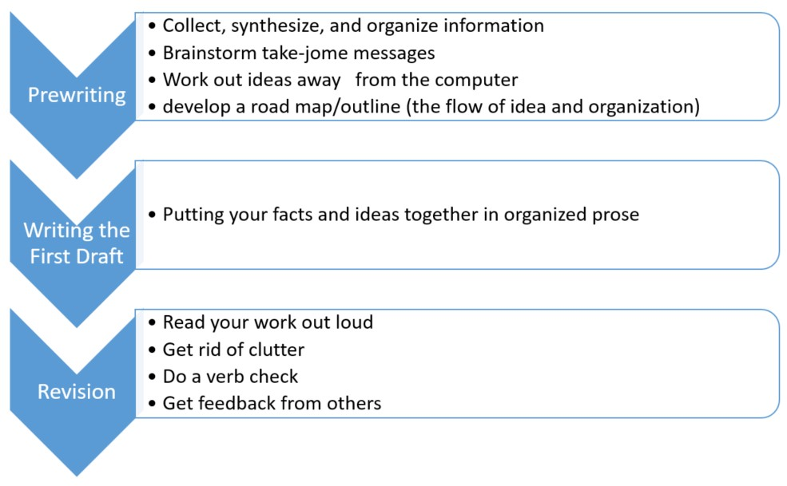
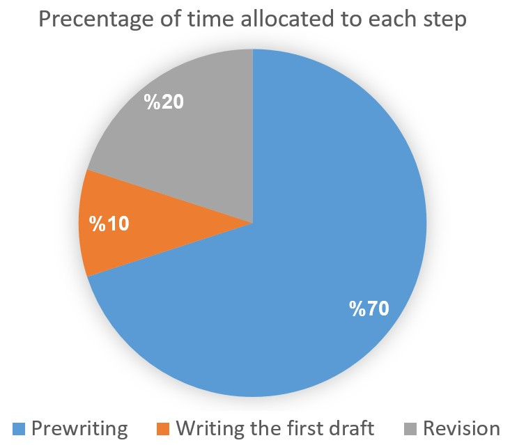

# SciWriting

This is my personal summary of the process of writing scientific articles according to the [Writing in the Sciences](https://www.coursera.org/learn/sciwrite?utm_medium=sem&utm_source=gg&utm_campaign=B2C_NAMER__coursera_FTCOF_career-academy_pmax-enhanced-NRL-w/in-14d-new-cust-country-US-country-CA&campaignid=20397118025&adgroupid=&device=c&keyword=&matchtype=&network=x&devicemodel=&adposition=&creativeid=&hide_mobile_promo&gclid=Cj0KCQjwtJKqBhCaARIsAN_yS_nBicTa7lbjHrlfWilNwQnSIbbY_BbBgmmY0L7O0uyvREvpZKaT4noaAsO1EALw_wcB) course, provided by Stanford & Coursera (Instructor: Dr. [Kristin Sainani](https://www.coursera.org/instructor/~1367410)). This course enables junior researchers to get started on publishin their results and findings.

This course divides the process of writing research articles to the follwoing phases:

    1. Prewriting
    2. Writing
    3. Revision
    4. Consistency Check

The main focal points of each phase is illustrated within the **Figure 1**:

*Figure1 - Phases of writing a research article and their main focal points*

Accoding to the instructor, time should be divided between these phases, accoding to **Figure 2**

*Figure2 - Phases and their corresponding time share*

## Prewriting Tips

### 1.	Get organized first!
*   Don’t try to write and gather information simultaneously!
*   Gather and organize information before writing the first draft.
*   Create an organizational system that suits you the best.
*   Spend more time organizing and less time writing. It’s just plain less painful.

### 2.	Develop a road-map
*   Arrange key facts and citations from the literature into a crude road map/outline before writing the first draft.
*   Think in paragraphs and sections…
*   Include the set of information, facts and citations belonging to each part of the paper (sections) in its corresponding section of the road map.
*   Gather snippets as much as possible. You would not use them all at the end, but it is good to possess all you can.

### 3.	Brainstorm away from the computer
*   Writing behind the desk and at computer can be intimidating. Take the opportunity to write while exercising, driving alone, waiting in the line, etc.
*   Following can be done when you are away from the computer:
    *   Work out take-home messages
    *   Organize your paper
    *   Write memorable lines

### 4.	Compositional Organization (tips for organizing the paper):

*   Like ideas should be grouped.
    *   Same idea is not supposed to be spread in different paragraphs.
    *   In case, same idea is spread in different paragraphs, they must be close to each other.
*   Like paragraphs should be grouped.
    *   Paragraphs including related identical or related topics must be close to each other.
    *   Don’t “Bait-and-switch’’ your reader too many times. Consider the following pattern when making a comparison or discussing a controversy:
        *   Arguments (all)
        *   Counter-arguments (all)
        *   Rebuttals (all)

## Writing Tips

### 1.	Try not to be a perfectionist!
*   The goal of the first draft is to get the ideas down in complete sentences in order.
    *   Sentences must be grammatically correct.
    *   Sentences are not supposed to sound good.
*   During the writing on the first draft, focus on logical organization more than sentence-level details.
    *   Work out high level ideas, take home messages and the logical organization of the whole draft.
    *   Sentence-level details would be fixed during the revision phase easily, but it is absolutely hard to fix organizational and logical problems during revision phase.

### 2.	Minimize the pain of writing the first draft by writing it quickly and efficiently.

*   Writing the first draft is the hardest step for most people. Write it quickly and efficiently to minimize the pain.
    *   Consider specific amount of time to write the first draft and try to finish it on time.
    *   Quick writing of first draft requires two perquisites: having a great pre writing process and not editing yourself during writing.

### 3.	First Draft are normally longer than final editions.
*   In addition to modifying sentence-level details, during revision phase the manuscript is checked for non-essential explanations and wordiness. Don’t worry if your first draft looks boring or too long.
*   Make sure all the information, facts and ideas that are useful, are included in the first draft.

## Revision

### 1.	Read your writing out loud.
*   The brain processes the spoken word differently than the written word!
    *   Awkwardness, wordiness and repetition is easier to detect when it is heard, rather than read.
    *   It may event work better if you record your voice and listening it later.

### 2.	Do a verb check.
*   Underline the main verb in each sentence and watch for:
    *   Lackluster verbs (there <ins>are</ins> many students who struggle with chemistry.)
    *   Passive verbs (the reaction <ins>was observed</ins> by her)
    *   Buried verbs (A careful monitoring of achievement levels before and after the introduction of computers in the teaching of our course <ins>revealed</ins> no appreciable change in student performances.)
*   Repletion of to be verbs, passive structures and buried verbs makes the manuscript boring. Modifying them makes significant difference.

### 3.	Don’t be afraid to cut!
*   Watch for:
    *   Unnecessary jargon and acronyms
    *   Repetitive words or phrases (teaches clinicians ->guides clinicians)
    *   Adverbs (very, really, quite, basically)

### 4.	Do an organizational review.
*   In the margins of your paper, tag each paragraph with a phrase or sentence that sums up the main point.
*   Then move paragraphs around to improve logical flow and bring similar ideas together.

### 5.	Get outside feedback
*   Ask someone outside your department to read your manuscript.
*   Without any technical background, they should easily grasp:
    *   The main findings
    *   Take-home messages
    *   Significance of your work
*   Ask them to point out particularly hard-to-read sentences and paragraphs!

## Consistency Check

### 1. Make sure that you have no contradictory in different sections of the manuscript.
### 2. Check for numerical consistency:
*   Abstract and the body of paper reporting different numbers
*   Numbers differ between figures and tables that are supposed to be identical.
### 3. Check your references carefully
*   Prevent referencing to nowhere (when authors cite a paper, but the cited paper does not include the referenced information)
*   Make sure you have cited the original paper, not a secondary source.
*   Mis-numbering the references, misinterpretation of the findings or exaggeration of them are all sources of references inconsistency.
